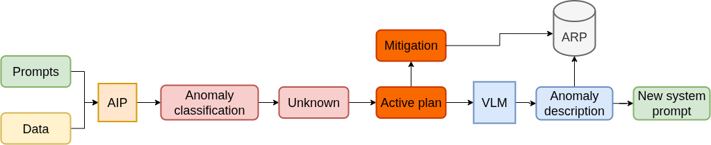

Situation understanding within the CONVINCE project consists in detecting, identifying and mitigating anomalies. The context being robotic systems performing a task, anomalies correspond to failures
that may occurre and interrupt the nominal behaviour of the robot while performing its computed task.

Situation learning allows to extend the systems' ability to detect, identify and mitigate known
anomalies, through `situation awareness`_, to the ability to do the same with unknown anomalies.

Unknown anomalies are failures that may happen while a system is executing its task and that we
didn't considered, being in nature unexpected.

Situation learning launches situation awareness and only applies changes if the identification 
returns 'unknown'.  At this point, a third inference of the VLM is executed to output an anomaly
description of the newly encountered situation. This new description will then be added to the 
system prompt anomalies list, becoming a known anomaly. The model still uses the same input data 
and a new user prompt, that askes for the description.

Later, outputs from `active/simulate plan`_ will be added to refine the description and the learning
procedure will only be launch if a mitigation plan for the unknown anomaly is found.

.. _situation awareness: <https://convince-project.github.io/sit-aw-aip/generic_principles.html>
.. _active/simulate plan: <https://github.com/convince-project/active-simulate-plan>

